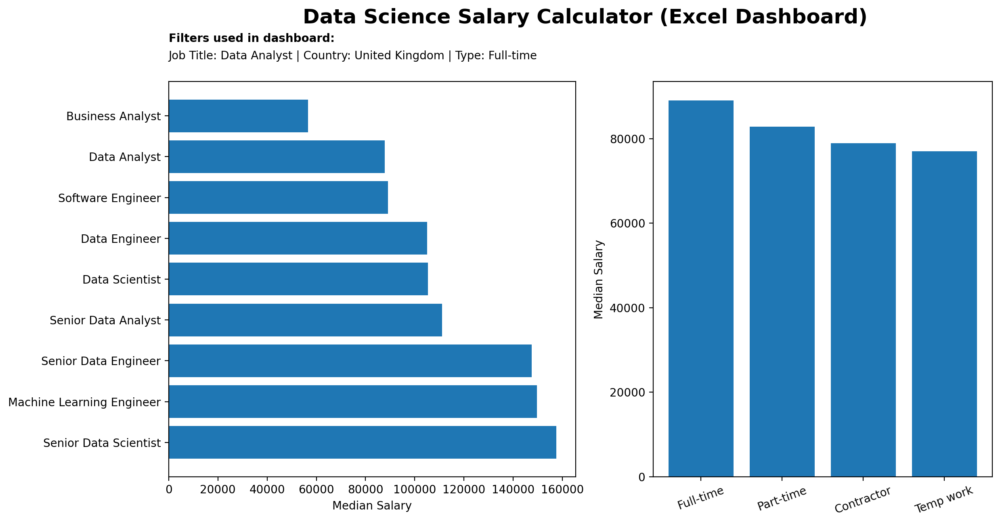

Data Science Salary Calculator (Excel Dashboard)

A professional Excel dashboard built to analyze 32,673 global data science job postings using interactive filters and dynamic formulas.

The dashboard allows users to compare median salaries across different job titles, countries, and employment types.

Dashboard Preview

Project Overview

This dashboard was built entirely in Microsoft Excel using formulas, lookup tables, and data validation.

Users can instantly calculate salary estimates by selecting:

Job Title

Country

Employment Type

The workbook updates automatically using supporting lookup tables and dynamic formulas.

Tools Used

Microsoft Excel

Data Validation

XLOOKUP

Lookup Tables

Dynamic Formulas

Conditional Formatting

Interactive Dashboard Design

Dataset

32,673 job postings

Global data science roles

Salary information

Employment types

Countries

Job platforms

Key Features

Interactive salary calculator

Job Title selector

Country selector

Employment Type selector

Automatic salary lookup

Supporting lookup tables

Project Structure

Sheet

	

Purpose

Dash

	

Interactive dashboard

Jobs

	

Cleaned dataset

Validation

	

Dropdown lists

Country

	

Country salary lookup

Title

	

Job title salary lookup

Type

	

Employment type lookup

Platform

	

Platform calculations

Skills Demonstrated

Excel Dashboard Design

Data Cleaning

Formula Logic

Lookup Functions

Interactive Reporting

Data Visualization

Insight 1

Senior Data Scientist has the highest median salary among the major roles.

The workbook shows a median salary of approximately $157,500 for Senior Data Scientists.

Insight 2

Senior Data Engineers also command premium salaries.

Median salary is approximately $147,500, highlighting the value of infrastructure-focused roles.

Insight 3

Data Scientists earn higher median salaries than Data Analysts.

Data Scientist: $105,300

Data Analyst: $87,750

This suggests a substantial salary gap between analytical and modeling-focused positions.

Insight 4

Full-time positions generally offer higher median salaries than contractor or temporary roles.

The employment-type lookup table indicates Full-time roles have a median salary of about $89,100.

Insight 5

Salary varies significantly by country.

For example:

Australia: about $109,500

Argentina: about $111,175

Albania: about $49,950

The dashboard makes these comparisons instantly through country filtering.
